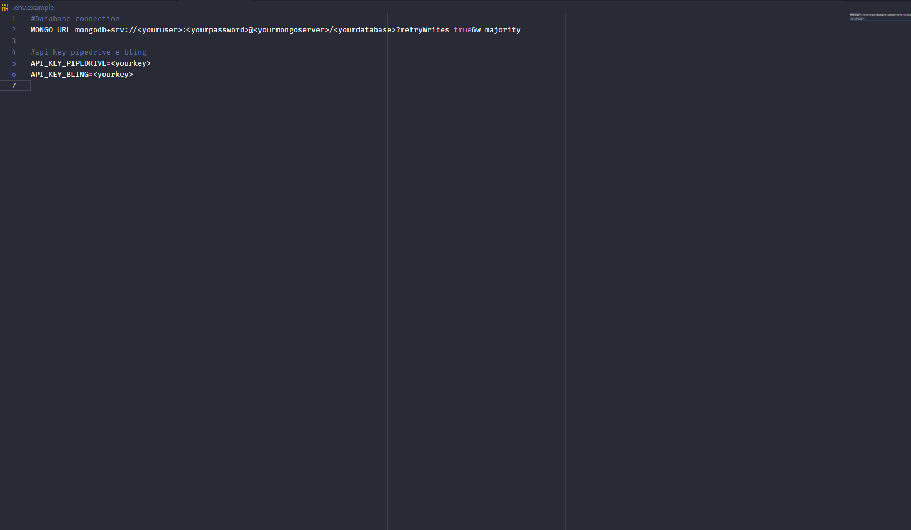

<h1 align="center">LinkAPI-Test</h1>
<p align="center">Solução para desafio da LinkApi.</p>

### Pré-requisitos

Antes de começar, você vai precisar ter instalado em sua máquina as seguintes ferramentas:
[Git](https://git-scm.com), [Node.js](https://nodejs.org/en/), 
Além disto é bom ter um editor para trabalhar com o código como [VSCode](https://code.visualstudio.com/);

Você também vai precisar criar uma conta na [MongoDbCloud](https://www.mongodb.com/cloud) para utilizar um banco de dados NoSql na nuvem. Criar contas na [Pipedrive](https://www.pipedrive.com/pt) e na [Bling](https://www.bling.com.br/) para uso de suas API


<h4 align="center"> 
	🚧  Api 🚀 Em construção...  🚧
</h4>

### Features

- [x] Criar contas testes nas plataformas Pipedrive e Bling.
- [x] Criar uma integração entre as plataformas Pipedrive e Bling. (A integração deve buscar as oportunidades com status igual a ganho no Pipedrive, depois inseri-las como pedido no Bling).
- [x] Criar banco de dados mongo, existem serviços como MongoDB Atlas para criar de graça
- [x] Criar uma collection no banco de dados MongoDB agregando as oportunidades inseridas no Bling por dia e valor total.
- [x] Criar endpoint para trazer os dados consolidados da collection do MongoDB.
- [ ] ...


### 🚀 APIENDPOINTS
<h3>/opportunities</h3>
<p> Mostra oportunidades com status "won", além de salvar as oportunidades que ainda não foram salva na base de dados e incluir novas oportunidades como pedido na bling. </p>

<h3>/opportunities/group-by-day</h3>
<p> Agrupamento por dia, mostrando total de valor pedido e contagem. </p>


### 🎲 Baixando projeto pelo git

```bash
# Clone este repositório em algum diretório
$ git clone <https://github.com/raziisz/api-test-linkapi.git>

```

### 🚀 Depois de baixar projeto crie um arquivo .env na raiz do projeto
<p align="center">Siga o exemplo abaixo</p>

<h1 align="center">
  
</h1>

### 🎲 Subindio API 

```bash
# Acesse a pasta do projeto no terminal/cmd
$ cd api-test-linkapi

# Instale as dependências
$ npm install

# Execute o comando para subir api
$ npm run dev 

# O servidor inciará na porta:3333 - acesse <http://localhost:3333> 
```

### 🛠 Tecnologias - API

As seguintes ferramentas foram usadas na construção do projeto na camada backend:

- [Node.js](https://nodejs.org/en/)
- [MongoDbAtlas](https://www.mongodb.com/cloud)
- [js2xmlparser](https://www.npmjs.com/package/js2xmlparser)
- [Express](https://expressjs.com/pt-br/)
- [Axios](https://github.com/axios/axios)

### Autor
---

<a href="http://raziisz.github.io/">
 
 <br />
 <sub><b>Luiz Felipe</b></sub></a> <a href="http://raziisz.github.io/" title="Dev">🚀</a>


Feito com ❤️ por Luiz Felipe 👋🏽 Entre em contato!

[](https://www.linkedin.com/in/luiz-felipe-libertino-a87840170/) 
[](mailto:raziel_libertino@hotmail.com)

